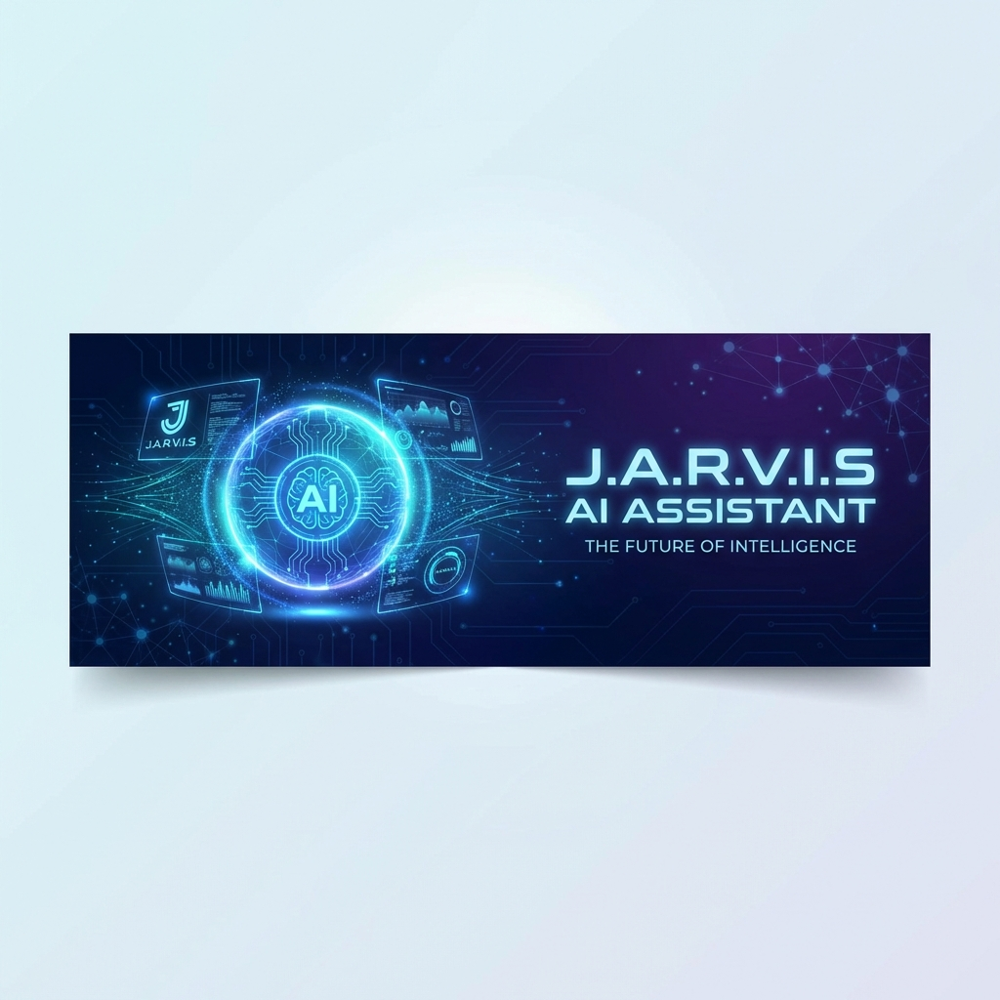
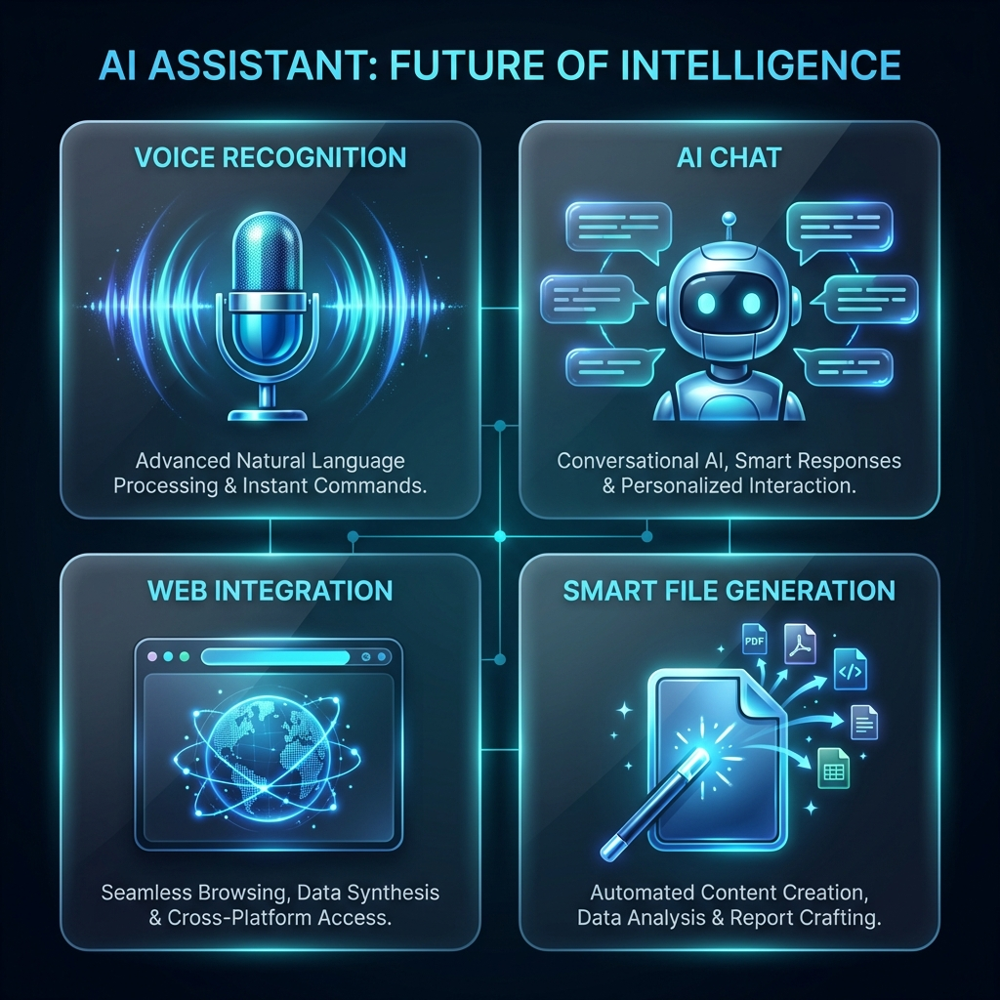
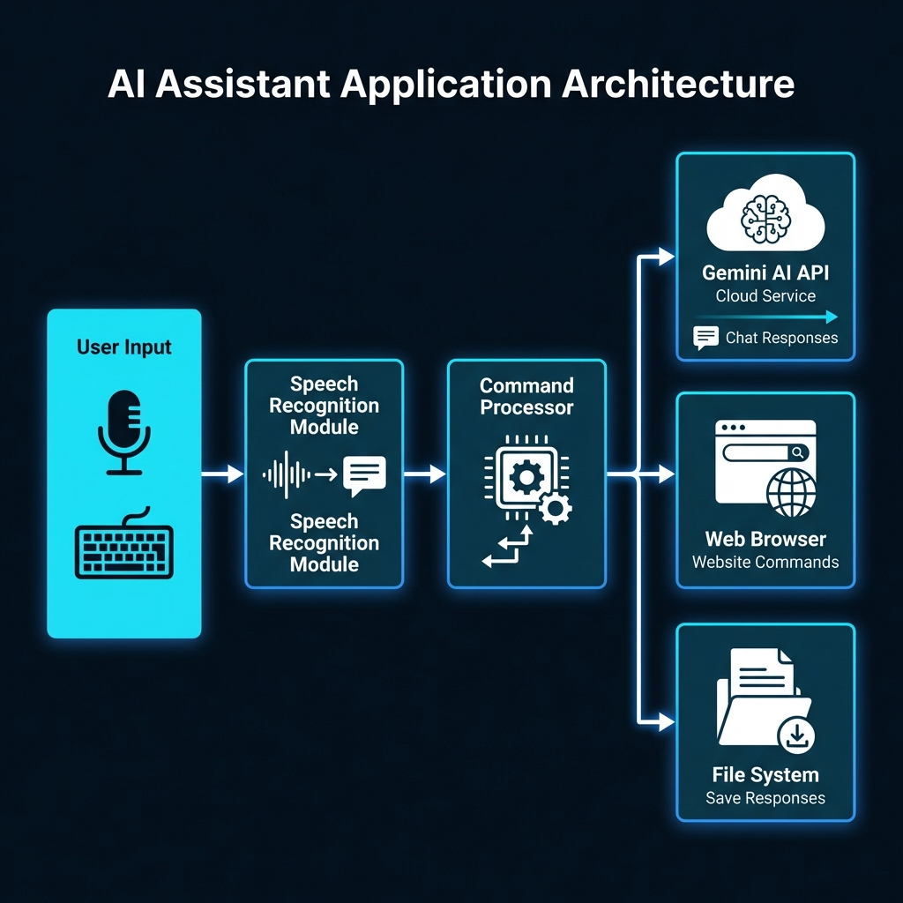
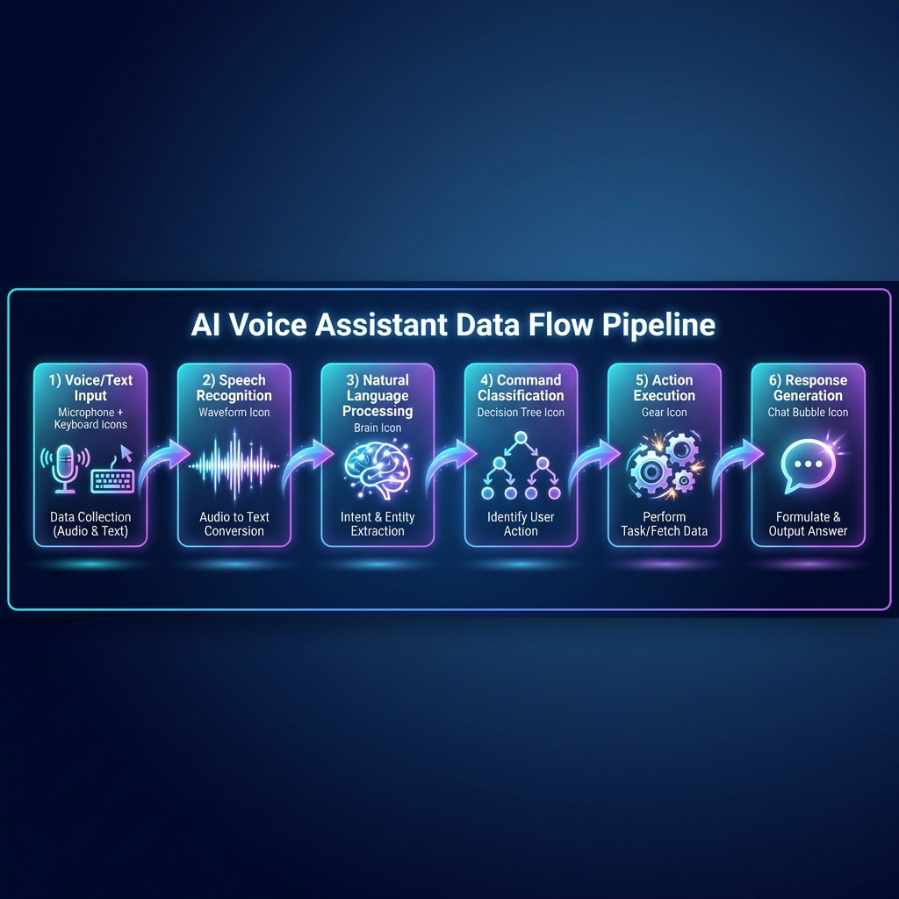

<p align="center">
  
</p>

<p align="center">
  
  
  
  
</p>

<h1 align="center">
  
  <br>
  J.A.R.V.I.S AI Assistant
</h1>

<p align="center">
  <em>🚀 Your Intelligent Personal Assistant Powered by Google Gemini AI</em>
</p>

<p align="center">
  
</p>

---

## 🌟 Overview

**J.A.R.V.I.S** (Just A Rather Very Intelligent System) is a cutting-edge AI-powered personal assistant built with Python, leveraging Google's state-of-the-art **Gemini 2.0 Flash** model for natural language understanding and generation. Experience seamless voice commands, intelligent conversations, and automated task execution.

---

## ✨ Key Features

<p align="center">
  
</p>

<table>
<tr>
<td width="50%">

### 🎤 Voice Recognition
- Real-time speech-to-text conversion
- Ambient noise adjustment
- Fallback to text input

</td>
<td width="50%">

### 🧠 AI-Powered Chat
- Context-aware conversations
- Powered by Gemini 2.0 Flash
- Persistent chat history

</td>
</tr>
<tr>
<td width="50%">

### 🌐 Web Integration
- Quick website launching
- YouTube video search & play
- Multi-platform support

</td>
<td width="50%">

### 📄 Smart File Generation
- AI-generated content export
- Automatic file organization
- Custom prompt responses

</td>
</tr>
</table>

---

## 🏗️ System Architecture

<p align="center">
  
</p>

The architecture follows a modular design pattern:
- **User Input Layer**: Accepts voice commands via microphone or text input via keyboard
- **Processing Layer**: Speech recognition and command classification
- **Execution Layer**: Routes commands to appropriate handlers (AI, Browser, File System)

---

## 🔄 Data Flow Pipeline

<p align="center">
  
</p>

| Stage | Description |
|-------|-------------|
| **1. Input** | Voice or text command received |
| **2. Recognition** | Speech converted to text using Google Speech API |
| **3. NLP** | Natural language understanding via Gemini AI |
| **4. Classification** | Command type identified and routed |
| **5. Execution** | Action performed (web, file, or chat) |
| **6. Response** | Result displayed to user |

---

## 🚀 Quick Start

### Prerequisites

- Python 3.9 or higher
- Google Gemini API Key ([Get one here](https://makersuite.google.com/app/apikey))
- Microphone (optional, for voice commands)

### Installation

```bash
# 1. Clone the repository
git clone https://github.com/yourusername/AiIntegratedOs.git
cd AiIntegratedOs

# 2. Install dependencies
pip install -r requirements.txt

# 3. Configure environment variables
# Create a .env file with:
echo "gemini_api_key=YOUR_GEMINI_API_KEY_HERE" > .env

# 4. Run the assistant
python main.py
```

---

## 🎯 Usage

### Voice Commands

| Command | Action |
|---------|--------|
| `open youtube` | Opens YouTube in browser |
| `open google` | Opens Google in browser |
| `open wikipedia` | Opens Wikipedia in browser |
| `open gemini` | Opens Google Gemini |
| `open chatgpt` | Opens ChatGPT |
| `play [song name] on youtube` | Searches & plays on YouTube |
| `the time` | Tells current time |
| `reset chat` | Clears conversation history |
| `jarvis quit` / `exit` | Exits the assistant |

### AI Features

| Command | Description |
|---------|-------------|
| `using artificial intelligence [prompt]` | Generates AI response and saves to file |
| `[any question]` | Engages in natural conversation with AI |

---

## ⚙️ Configuration

Customize your experience by modifying these flags in `main.py`:

```python
# Enable/Disable Voice Recognition
USE_SPEECH_RECOGNITION = True   # Set to False for text-only mode

# Enable/Disable AI Chatbot
USE_CHATBOT = True              # Set to False to disable AI responses
```

---

## 📁 Project Structure

```
AiIntegratedOs/
│
├── 📄 main.py              # Core application logic
├── 📄 requirements.txt     # Python dependencies
├── 📄 .env                 # API keys (create this file)
├── 📄 .gitignore           # Git ignore rules
├── 📄 README.md            # Documentation
│
├── 📂 assets/              # Project images & diagrams
│   ├── 🖼️ banner.png       # Project banner
│   ├── 🖼️ logo.png         # Project logo
│   ├── 🖼️ architecture.png # System architecture diagram
│   ├── 🖼️ pipeline.png     # Data flow pipeline
│   └── 🖼️ features.png     # Features showcase
│
└── 📂 Gemini/              # AI-generated responses (auto-created)
    └── 📄 *.txt            # Saved AI responses
```

---

## 🛠️ Tech Stack

<p align="center">
  
</p>

| Technology | Purpose |
|------------|---------|
| **Python 3.9+** | Core programming language |
| **Google Generative AI** | Gemini 2.0 Flash integration |
| **SpeechRecognition** | Voice command processing |
| **PyAudio** | Audio input handling |
| **python-dotenv** | Environment variable management |

---

## 🔮 Roadmap

- [ ] 🔊 Text-to-Speech output
- [ ] 📱 Mobile app integration
- [ ] 🏠 Smart home device control
- [ ] 📅 Calendar & reminder integration
- [ ] 🎨 Custom voice themes
- [ ] 🔐 Multi-user authentication
- [ ] 🌍 Multi-language support
- [ ] 🔌 Plugin system for extensions

---

## 🤝 Contributing

Contributions are welcome! Here's how you can help:

1. **Fork** the repository
2. **Create** a feature branch (`git checkout -b feature/AmazingFeature`)
3. **Commit** your changes (`git commit -m 'Add AmazingFeature'`)
4. **Push** to the branch (`git push origin feature/AmazingFeature`)
5. **Open** a Pull Request

---

## 📜 License

This project is licensed under the MIT License - see the [LICENSE](LICENSE) file for details.

---

## 👤 Author

<p align="center">
  
  <br>
  <strong>Ansh Singh</strong>
  <br>
  <em>AI Enthusiast & Developer</em>
</p>

<p align="center">
  <a href="https://github.com/yourusername">
    
  </a>
  <a href="https://linkedin.com/in/yourusername">
    
  </a>
</p>

---

## ⭐ Show Your Support

If you find this project helpful, please consider giving it a ⭐ on GitHub!

<p align="center">
  
  
</p>

<p align="center">
  <em>© 2026 J.A.R.V.I.S AI Assistant. All Rights Reserved.</em>
</p>
